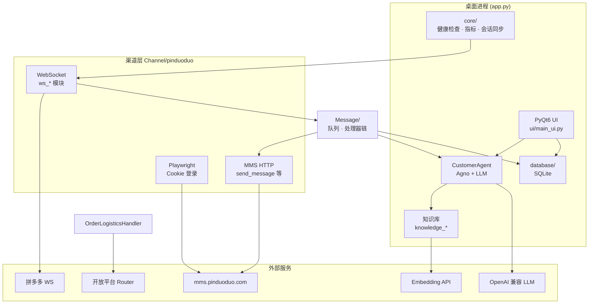
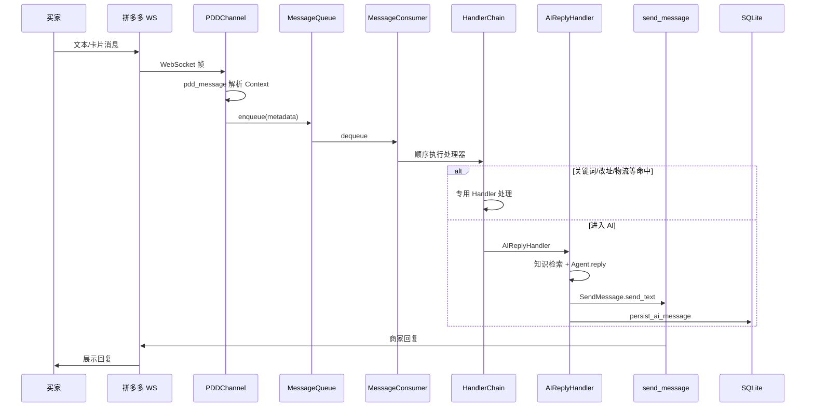
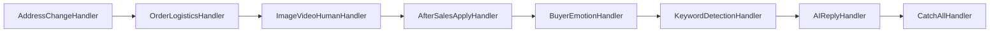
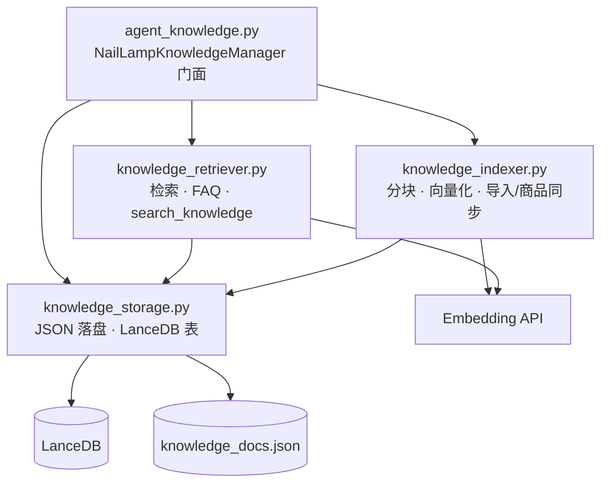
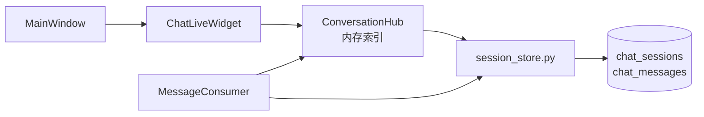
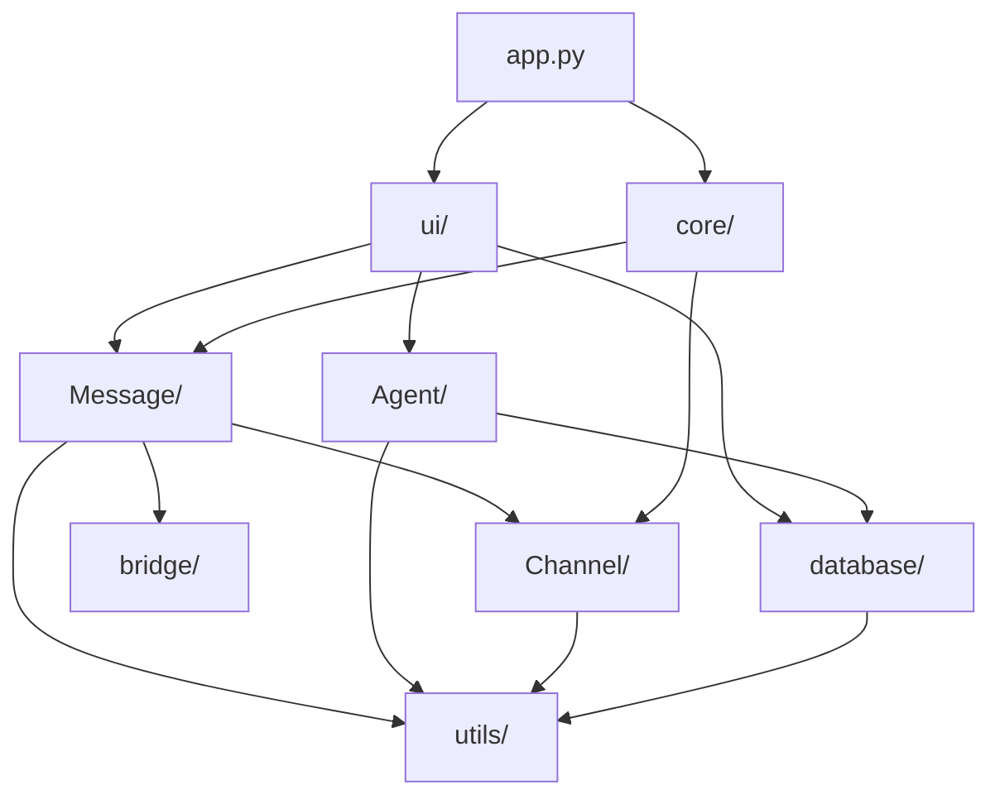

# Customer-Agent 架构说明

本文描述桌面端 AI 客服的核心数据流与模块依赖，便于 onboarding 与二次开发。

---

## 1. 系统总览

---

## 2. 买家消息数据流

### 处理器链顺序

任一 Handler 返回「已处理」则链条终止；未处理则由 Consumer 触发 `fallback_reply` 安抚。

---

## 3. 知识库模块依赖

知识库自 `agent_knowledge.py` 拆分为三层（门面仍从原路径 import）：

| 模块 | 职责 |
|------|------|
| `knowledge_storage.py` | 店铺上下文、`knowledge_docs.json` 读写、LanceDB 连接与全量/增量同步 |
| `knowledge_indexer.py` | 长文分块、embedding 补齐、文件导入、`goods_sync` 批量写入 |
| `knowledge_retriever.py` | 向量检索 + 本地打分兜底、父/子库 inherit_key 覆盖、FAQ 直答 |
| `agent_knowledge.py` | 单例 `get_knowledge_manager()`、内置产品兜底数据、向后兼容别名 |

**存储层约定**：LanceDB 按 ID 删除统一走 `lancedb_delete_filter()`（转义单引号）；建索引向量用 `_embedding_text_for_doc()`（标题+正文），检索侧仍用 `_build_embedding_query_text()`（含同义词扩展）。

---

## 4. UI 与会话状态

- **权威数据源**：SQLite 中的 `chat_sessions` / `chat_messages`。
- **Hub**：UI 列表、未读数、预览的内存加速层；持久化后通过 `session_store` 回刷。
- **离开聊天页**：`main_ui` 仅在「从聊天页切到其他页」时调用 `_restore_ai_for_current_if_manual()`，避免 stackedWidget 初始化误触发。

---

## 5. 可观测性

| 端点 | 含义 |
|------|------|
| `GET /health` | 进程存活 |
| `GET /ready` | WebSocket 已连接且消费者在跑 |
| `GET /metrics` | `app_metrics`：处理量、队列深度、`cache_sizes`（Hub / 图片 LRU / 买家锁）等 |

生产部署见 [生产部署说明.md](生产部署说明.md)。

---

## 6. 主要包依赖（逻辑层）

**原则**：`bridge` 仅放 Context/Reply 等轻量类型；避免 `Message` ↔ `Agent` 循环 import（阶段常量放在 `core/session_stages.py`）。
