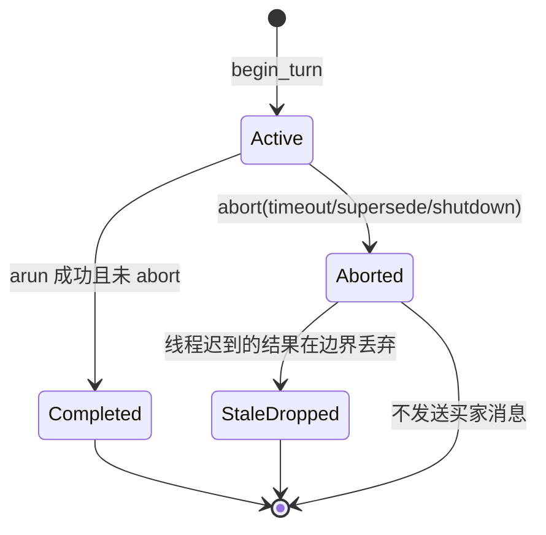
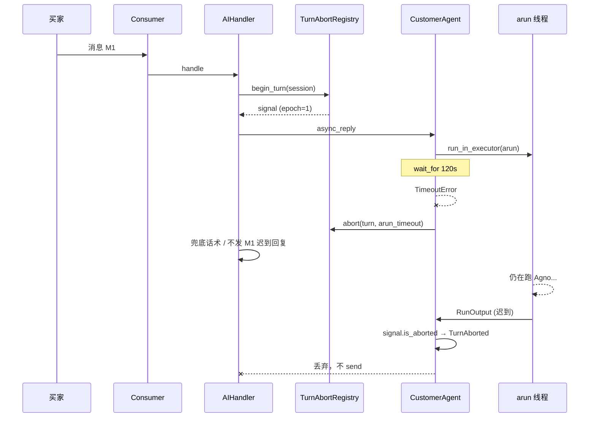

# LLM / Tool 超时协作取消（Turn Abort）设计

> 状态：**已实现**（Phase 1–4 + Phase D/F 运维项）  
> 关联：`Agent/CustomerAgent/agent.py`、`utils/agno_tool_offload.py`、`Message/handlers/ai_handler.py`、`Message/core/consumer.py`

---

## 1. 背景

### 1.1 现状（Phase P2 已落地）

| 机制 | 行为 | 局限 |
|------|------|------|
| `_ARUN_EXECUTOR(max_workers=1)` | arun 最多 1 个后台线程 | 超时后线程仍跑完，占满 executor → **下一单 arun 排队** |
| `asyncio.wait_for(..., timeout)` | WS loop 不阻塞 | 无法终止线程内 `run_until_complete` |
| `@offload_tool` + `fut.cancel()` | tool 超时返回文案 | `cancel()` 对已开始执行的线程无效 |
| `_arun_lock_for_current_loop()` | 同 loop 串行 arun | 超时释放锁后，旧 arun 与新 arun 可能**并发 corrupt Agno 内部状态** |

### 1.2 目标

1. **语义取消**：超时或新消息到达时，丢弃旧 turn 的结果，不再发送给买家。
2. **协作式中断**：长 tool（分页拉商品）在页间检查 abort，尽快退出。
3. **资源有界**：arun 线程 / tool 线程池不无限堆积；可观测「孤儿 turn」数量。
4. **与 Watchdog 对齐**：abort 后主动 `notify_outbound` 或走既有兜底，避免 `ai_timeout` 误报。

### 1.3 非目标

- **不能**强杀 Python 线程（无 `Thread.kill`）。
- **不能**保证 OpenAI SDK / `requests` 内 HTTP 立刻断开（依赖 per-request timeout）。
- **不**替换 Agno 官方 cancellation API（若未来 SDK 提供，可适配为 backend）。

---

## 2. 核心概念

### 2.1 Turn（轮次）

一次「买家消息 → 责任链 →（可能）AI arun → 出站」构成一个 **Turn**。

```
turn_id = f"{session_key}:{epoch}"
```

- `session_key`：沿用 `ai_reply_watchdog.resolve_session_key`（`shop_id/user_id/from_uid`）。
- `epoch`：该 session 上单调递增整数（可与 `_watchdog_epoch` 共用或独立 `turn_epoch`）。

### 2.2 AbortSignal（协作取消令牌）

```python
@dataclass
class TurnAbortSignal:
    turn_id: str
    _event: threading.Event  # 跨线程可见

    def abort(self, reason: str = "") -> None: ...
    def is_aborted(self) -> bool: ...
    def reason(self) -> str: ...
    def check(self) -> None:  # 未 abort 则 return；已 abort 则 raise TurnAborted
```

- 用 `threading.Event` 而非 `asyncio.Event`：arun 在**独立线程 + 私有 loop**，tool 在**线程池**。
- 通过 **`contextvars.ContextVar`** 向下传递：`current_turn_abort: ContextVar[Optional[TurnAbortSignal]]`。

### 2.3 TurnAbortRegistry（会话级注册表）

```text
core/turn_abort.py
├── class TurnAbortRegistry
│   ├── begin_turn(session_key) -> TurnAbortSignal   # 中止同 session 上一 turn
│   ├── abort_turn(turn_id, reason)
│   ├── get_active(session_key) -> Optional[TurnAbortSignal]
│   └── stats() -> {active, aborted_total, stale_dropped_total}
└── turn_abort_registry = TurnAbortRegistry(max_sessions=5000)  # LRU
```

**规则：**

1. 每个 session **同时最多 1 个 active turn**。
2. 新 turn `begin_turn` 时，对旧 turn 调用 `abort("superseded_by_new_inbound")`。
3. 外层 `wait_for` 超时时，对当前 turn 调用 `abort("arun_timeout")`。
4. 应用退出 / 会话转人工 escalated 时，可 `abort("shutdown"|"escalated")`。

---

## 3. 架构总览

```mermaid
flowchart TB
    subgraph Inbound["入站"]
        C[MessageConsumer]
        WD[ai_reply_watchdog]
    end

    subgraph Abort["Turn Abort 层 (新)"]
        R[TurnAbortRegistry]
        CV[current_turn_abort ContextVar]
    end

    subgraph AI["AI 路径"]
        H[AIReplyHandler]
        A[CustomerAgent.async_reply]
        AR[_ARUN_EXECUTOR 单线程]
        PL[私有 event loop + arun]
    end

    subgraph Tools["Tool 路径"]
        OT[@offload_tool]
        TP[Tool 线程池]
        T1[get_shop_products 分页]
    end

    C --> WD
    C --> H
    H -->|begin_turn| R
    H --> A
    A -->|set ContextVar| CV
    A --> AR --> PL
    PL --> OT --> TP --> T1
    T1 -->|check abort 页间| CV
    A -->|超时 abort_turn| R
    A -->|丢弃 stale RunOutput| H
```

---

## 4. 关键路径改造

### 4.1 MessageConsumer / AIReplyHandler

**插入点：** `AIReplyHandler.handle` 入口（或 consumer 在 `start_inbound_watchdog` 之后）。

```python
signal = turn_abort_registry.begin_turn(session_key)
metadata["_turn_id"] = signal.turn_id
token = set_current_turn_abort(signal)
try:
    reply = await self._get_ai_reply_with_sync_retry(...)
finally:
    reset_current_turn_abort(token)
```

- 与 watchdog epoch 对齐：`metadata["_watchdog_epoch"]` 与 turn epoch 使用同一计数器，避免两套状态。
- `asyncio.TimeoutError` 捕获处增加：`turn_abort_registry.abort_turn(signal.turn_id, "arun_timeout")`。

### 4.2 CustomerAgent.async_reply

```python
async def async_reply(...):
    signal = get_current_turn_abort()  # 由 Handler 注入
    ...
    try:
        response = await asyncio.wait_for(
            loop.run_in_executor(_ARUN_EXECUTOR, partial(_run_agent_arun_blocking, ..., signal)),
            timeout=timeout_sec,
        )
    except asyncio.TimeoutError:
        if signal:
            signal.abort("arun_timeout")
        raise
    # 返回前再检查（race：线程刚好完成）
    if signal and signal.is_aborted():
        raise TurnAborted(signal.reason())
    return Reply(...)
```

### 4.3 _run_agent_arun_blocking + 私有 loop

```python
def _run_agent_arun_blocking(..., signal: Optional[TurnAbortSignal]) -> RunOutput:
    token = set_current_turn_abort(signal) if signal else None
    loop = asyncio.new_event_loop()
    try:
        async def _do():
            if signal and signal.is_aborted():
                raise TurnAborted(signal.reason())
            return await self._agent.arun(...)

        task = loop.create_task(_do())
        # 注册 abort 回调：abort 时 cancel task + stop loop
        if signal:
            _wire_abort_to_loop(signal, loop, task)

        return loop.run_until_complete(task)
    finally:
        reset_current_turn_abort(token)
        _shutdown_loop(loop)
```

**`_wire_abort_to_loop`：**

- `signal._event` 触发后：
  1. `task.cancel()`（Agno 若 await 中可抛 `CancelledError`）
  2. `loop.call_soon_threadsafe(loop.stop)` — **尽快**结束 `run_until_complete`（Agno 同步阻塞时仍可能延迟）
- 不保证立即释放线程，但保证 **loop 关闭 + 结果不被上层采纳**。

### 4.4 @offload_tool

```python
def offload_tool(fn):
    @wraps(fn)
    def wrapper(*args, **kwargs):
        signal = get_current_turn_abort()
        if signal and signal.is_aborted():
            return _tool_aborted_message(fn.__name__, signal.reason())

        fut = _TOOL_EXECUTOR.submit(_run_tool_with_abort, fn, signal, args, kwargs)
        try:
            return fut.result(timeout=_tool_timeout_sec())
        except concurrent.futures.TimeoutError:
            if signal:
                signal.abort("tool_timeout")
            fut.cancel()
            return _tool_timeout_message(fn.__name__)
    return wrapper

def _run_tool_with_abort(fn, signal, args, kwargs):
    token = set_current_turn_abort(signal)
    try:
        return fn(*args, **kwargs)
    finally:
        reset_current_turn_abort(token)
```

### 4.5 长 tool 协作检查（以 get_shop_products 为例）

```python
for page in range(1, max_pages + 1):
    check_turn_abort()  # raises TurnAborted → Agno 视为 tool 失败，可转人工话术
    resp = product_manager.list_page(page)  # 已有 HTTP timeout
    ...
```

分页、OCR、embedding 等等待循环均加 **页/批间** `check_turn_abort()`，不在单次 HTTP 内 busy-wait。

### 4.6 结果丢弃（Stale Turn）

即使孤儿线程最终返回 `RunOutput`，在 `async_reply` 边界：

```python
if signal.is_aborted():
    logger.info("丢弃 stale arun 结果 turn={} reason={}", signal.turn_id, signal.reason())
    raise TurnAborted(...)  # AIHandler 走 _handle_unknown_ai_failure / 兜底
```

**这是整个设计最关键的一行** — 不依赖线程能否被杀。

---

## 5. Turn 状态机



---

## 6. 与现有组件关系

| 组件 | 关系 |
|------|------|
| `_ARUN_EXECUTOR(1)` | 保留；abort 后线程可能仍占用，但 **结果丢弃** + **新 turn 可 abort 旧 turn** 避免错误回复 |
| `_arun_lock` | 保留；可考虑超时 abort 后 **仍持有锁直到 orphan 完成**（可选 Phase 2b，减少 Agno 并发） |
| Watchdog | abort 时调用 `notify_outbound_from_metadata` 或专用 `dismiss_watchdog_for_turn` |
| Buyer lock | 不变；同买家仍串行消费 |
| dead-letter | `TurnAborted` 一般 **不写** dead-letter（预期行为）；仅 `process_failure` 写 |

---

## 7. 配置项（建议）

写入 `config.json.example` / `config_schema.py` 的 `chat` 段：

```json
{
  "chat": {
    "llm_arun_timeout_sec": 120,
    "agno_tool_timeout_sec": 90,
    "turn_abort_enabled": true,
    "turn_abort_supersede_on_new_inbound": true,
    "turn_abort_loop_stop_grace_ms": 500,
    "turn_abort_registry_max_sessions": 5000
  }
}
```

| 键 | 默认 | 说明 |
|----|------|------|
| `turn_abort_enabled` | `true` | 总开关 |
| `turn_abort_supersede_on_new_inbound` | `true` | 同买家新消息是否 abort 上一 turn |
| `turn_abort_loop_stop_grace_ms` | `500` | abort 后等待 loop 自行结束，再 `loop.close` |
| `turn_abort_registry_max_sessions` | `5000` | LRU 上限 |

---

## 8. 分阶段实施（建议 TDD 顺序）

### Phase 1 — 令牌 + 丢弃（最小可用，约 1–2 PR）

- [x] `core/turn_abort.py` + `TurnAborted` 异常
- [x] `AIReplyHandler` 注入 `begin_turn` / `finally reset`
- [x] `async_reply` 超时 `abort` + 返回前 `is_aborted` 检查
- [x] 测试：`test_turn_abort_drops_stale_result_on_timeout`
- [x] 测试：`test_new_inbound_aborts_previous_turn`

**验收：** arun 超时后即使线程 5s 后返回，买家 **不会** 收到迟到回复。

### Phase 2 — Loop / Task 协作（约 1 PR）

- [x] `_wire_abort_to_loop`：abort → cancel task + stop loop
- [x] `@offload_tool` 入口/出口 abort 检查
- [x] 测试：mock 慢 arun，abort 后 loop 在 grace 内退出

### Phase 3 — Tool 内页间检查（约 1 PR）

- [x] `check_turn_abort()` 工具函数
- [x] `get_shop_products` / `send_goods_link` / `move_conversation` 分页或 MMS 前检查
- [x] 测试：分页中途 abort，不再请求下一页

### Phase 4 — 观测与运维（可选）

- [x] `core/app_metrics.py`：`turn_abort_total{reason}`、`turn_stale_dropped_total`
- [x] `/metrics` 暴露；日志结构化 `turn_id` / `reason`
- [x] 健康检查：`_ARUN_EXECUTOR` 队列深度 > 0 持续 N 秒 → warning 日志（`turn_abort_watchdog`）

---

## 9. 测试矩阵

| 场景 | 断言 |
|------|------|
| arun 正常完成 | 不 abort；正常 Reply |
| arun 超时 | `TurnAborted`；无 outbound；watchdog 取消 |
| 超时后线程迟到返回 | `async_reply` 抛 `TurnAborted`；send 未调用 |
| 同 session 连发两条 | 第一条 abort；仅第二条可产生 outbound |
| tool 分页中途 abort | 不再发 HTTP；返回 tool 中断文案 |
| `turn_abort_enabled=false` | 行为与现网一致（兼容开关） |
| 应用 shutdown | `abort_all` 或 registry clear；无新 arun |

---

## 10. 风险与缓解

| 风险 | 缓解 |
|------|------|
| Agno `arun` 长时间同步阻塞，loop.stop 无效 | **边界丢弃结果**（Phase 1 必须）；executor 单线程限制损害面 |
| abort 后 SqliteDb 仍被 orphan 写入 | Agno session 写入与 turn 绑定；Phase 2 研究 `session_id` 含 epoch 或 turn 结束后 reject DB write（若可 hook） |
| 同 session 双 turn 短暂并发 | `_arun_lock` + single executor；Phase 2b 可选「abort 后等待 orphan 完成再释放锁」 |
| ContextVar 跨线程丢失 | arun/tool 入口 **显式** `set_current_turn_abort(signal)` |

---

## 11. 文件清单（预计）

| 文件 | 变更 |
|------|------|
| `core/turn_abort.py` | **新建** Registry + Signal + ContextVar |
| `Agent/CustomerAgent/agent.py` | async_reply / `_run_agent_arun_blocking` 接入 |
| `utils/agno_tool_offload.py` | abort 感知 wrapper |
| `Message/handlers/ai_handler.py` | begin_turn / 捕获 TurnAborted |
| `Agent/CustomerAgent/tools/get_product_list.py` 等 | 页间 `check_turn_abort` |
| `config_schema.py` / `config.json.example` | 新配置项 |
| `test/test_turn_abort.py` | **新建** Phase 1–3 测试 |

---

## 12. 时序（超时路径）



---

## 13. 结论

本设计采用 **「会话 turn + 协作 abort + 边界丢弃 stale 结果」** 三层防御，在 Python 无法强杀线程的前提下，保证：

1. 买家侧不会收到超时/被 supersede 的迟到 AI 回复；
2. 长 tool 可尽快停止无意义工作；
3. 与现有 Watchdog、单线程 arun executor、责任链兼容，可按 Phase 1→4 渐进落地。

**建议下一步：** 按 Phase 1 实现 `core/turn_abort.py` 并写 `test/test_turn_abort.py`（TDD）。
