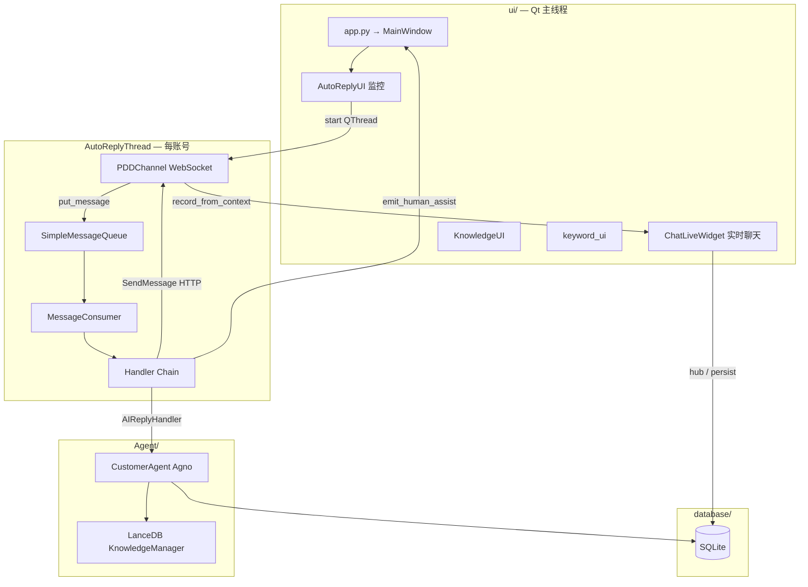

# Customer-Agent 代码架构说明

> **文档性质**：面向阅读/二次开发者的**代码与架构说明**，不是操作手册。  
> 使用步骤见 [小白使用说明.md](./小白使用说明.md)；仓库维护约定见根目录 [CLAUDE.md](../CLAUDE.md)。

---

## 1. 项目定位与技术栈

**Customer-Agent** 是面向拼多多商家的 **PyQt6 桌面端** AI 客服系统：通过 WebSocket 接收买家消息，经异步消息队列与处理器链决策后，调用 LLM + 知识库生成回复，或转人工、发卡片、查物流等。

| 层次 | 主要技术 |
|------|----------|
| UI | PyQt6、PyQt-Fluent-Widgets |
| AI | [Agno](https://github.com/agno-agi/agno)、OpenAI 兼容 API、LanceDB 向量库 |
| 持久化 | SQLAlchemy + SQLite（账号、会话、消息、关键词） |
| 渠道 | `websockets`（`m-ws.pinduoduo.com`）、`requests`（`mms.pinduoduo.com`）、Playwright（登录拿 Cookie） |
| 开放平台 | `gw-api.pinduoduo.com/api/router`（签名 Router，物流/订单等） |
| 并发 | 每账号独立 `QThread` + `asyncio` 事件循环；消费者信号量控制并发 |
| 配置 | `config.py` 线程安全读写 `config.json`；可选 `utils/secure_config` + `.env` |
| 依赖管理 | `uv` + `pyproject.toml` |

---

## 2. 总体架构



**线程模型要点**：

- **GUI 主线程**：`QApplication`、所有 `QWidget`、人工协助弹窗。
- **AutoReplyThread**（`ui/auto_reply_ui.py`）：`asyncio.new_event_loop()` + `PDDChannel.start_account()`，WebSocket 与消息消费均在此线程。
- **跨线程 UI**：`utils/qt_threading.run_on_main_thread` + `core/human_assist_bus` + `core/human_assist_ui.setup_human_assist_popup`，禁止在 WS 线程直接创建/操作 QWidget。

---

## 3. 启动与初始化顺序

入口：`app.py` → `main()`。

```text
1. config（config.py 单例，加载/合并 config.json）
2. configure_standard_services()（core/di_container.py）
   → ConnectionStatusManager、DatabaseManager 等
3. QApplication + init_main_thread_bridge() + get_human_assist_bus()
4. MainWindow（ui/main_ui.py）延迟 200ms lazy_load_views
5. setup_human_assist_popup(main_window)  # 尽早挂接 assist_requested
6. SessionIdleCloserService  # 买家离线自动 closed
```

`app.py` 头部注释说明了**禁止**在 import 阶段拉起过重依赖（如未必要的 LanceDB），部分模块使用 **lazy import** 打破循环依赖（典型：`Message` ↔ `Channel/pinduoduo`）。

---

## 4. 目录结构与模块职责

```text
Customer-Agent-main/
├── app.py                      # 进程入口、boot.log、faulthandler
├── config.py                   # Config 单例、config_base 默认值、点号键访问
├── bridge/                     # 与渠道无关的消息抽象
│   ├── context.py              # Context, ContextType, PinduoduoKwargs
│   └── reply.py                # Reply / ReplyType
├── Channel/
│   ├── channel.py              # Channel 抽象基类
│   └── pinduoduo/
│       ├── pdd_chnnel.py       # PDDChannel：WS、入队、消费者装配（注意文件名拼写）
│       ├── pdd_message.py      # PDDChatMessage 解析
│       ├── pdd_login.py        # Playwright 登录、Cookie 刷新
│       └── utils/
│           ├── base_request.py # Cookie + 重试 + 会话过期再登录
│           └── API/            # MMS / 开放平台 HTTP 封装
├── Message/
│   ├── handler_chain_factory.py
│   ├── core/queue.py, consumer.py
│   ├── handlers/               # 业务处理器
│   └── ai_queue_load.py        # 排队降级统计
├── Agent/
│   ├── bot.py                  # Bot 抽象
│   └── CustomerAgent/
│       ├── agent.py            # CustomerAgent（Agno Agent + tools）
│       ├── agent_knowledge*.py # 知识库 LanceDB / SQLite
│       ├── tools/              # 转接、商品列表、发商品链接
│       └── readers/            # PDF/Excel/Doc 入库
├── core/
│   ├── di_container.py
│   ├── human_assist_bus.py     # 跨线程人工协助信号
│   ├── human_assist_ui.py      # 主窗口级弹窗挂接
│   ├── session_idle_closer.py
│   ├── chat_sync.py
│   ├── connection_status.py
│   └── ops_telemetry.py
├── database/
│   ├── models.py               # ORM 表定义
│   ├── db_manager.py           # 业务 CRUD、会话 ai_mode
│   └── chat_persist.py         # 消息持久化、升级系统 note
├── ui/                         # 各功能页 + 设计系统
└── utils/                      # 日志、路径、合并买家连发、时间戳等
```

---

## 5. 核心数据模型：`bridge.context`

渠道收到的原始 JSON 在 `PDDChannel._convert_to_context()` 中转为统一结构：

| 字段 | 含义 |
|------|------|
| `Context.type` | `ContextType` 枚举：TEXT、IMAGE、ORDER_INFO、SYSTEM_* 等 |
| `Context.content` | 文本或序列化后的 JSON 字符串 |
| `Context.kwargs` | `PinduoduoKwargs`：shop_id、user_id、from_uid、nickname、msg_id… |
| `Context.channel_type` | 当前为 `ChannelType.PINDUODUO` |

**入队条件**（`PDDChannel._should_queue_message`）：TEXT、IMAGE、VIDEO、EMOTION、GOODS_*、ORDER_INFO 等。  
**立即处理**（不入队）：SYSTEM_STATUS、AUTH、WITHDRAW、MALL_CS、TRANSFER 等（见 `_should_process_immediately`）。

---

## 6. 端到端消息流

### 6.1 下行（买家 → 系统）

```text
WebSocket on_message
  → PDDChatMessage
  → Context
  → conversation_hub.record_from_context()     # UI 会话列表
  → put_message(queue_name, context)           # asyncio.Queue
  → MessageConsumer._process_message()
       metadata 注入 shop_id / user_id / from_uid / channel_name
       start_inbound_watchdog()                 # 150s 兜底计时
       for handler in handlers:                 # 链式，首个 success 即 break
  → SendMessage.send_text / 卡片 / 转接 API
  → chat_persist / notify_outbound_reply()      # 取消 watchdog
```

### 6.2 上行（商家 → 买家）

| 路径 | 代码入口 |
|------|----------|
| AI / 处理器自动回复 | `AIReplyHandler._send_reply` → `SendMessage` |
| 实时聊天手动发送 | `ui/chat_ui.py` `SendHumanMessageThread` |
| 工具调用发链接 | `Agent/CustomerAgent/tools/send_goods_link.py` |

手动发送成功后会调用 `notify_outbound_reply()`，与 AI 回复一样会 **mark_delivered**，避免误触发 150s 转人工。

### 6.3 会话键 `session_key`

格式：`{channel_name}:{shop_id}:{seller_user_id}:{buyer_uid}`

定义于 `Message/handlers/ai_reply_watchdog.resolve_session_key()`，用于：

- Watchdog 的 epoch / 是否已回复
- `AIReplyHandler._is_ai_mode_enabled()` 查 DB 里 `ChatSession.ai_mode`
- 运营遥测、买家连发合并等

---

## 7. Message 子系统

### 7.1 队列与消费者

- **`SimpleMessageQueue`**（`Message/core/queue.py`）：`asyncio.Queue`，可选去重。
- **`MessageConsumer`**（`Message/core/consumer.py`）：
  - `max_concurrent`：默认 28（`chat.message_consumer_max_concurrent`），与 API 上限留余量。
  - **按买家串行**：`_buyer_seq_locks[user_key]`，避免同买家多条消息并行 LLM 导致乱序。
  - 处理前 `start_inbound_watchdog`；处理器成功后由发送路径 `notify_outbound_reply` 结束计时。

### 7.2 处理器链

由 `Message/handler_chain_factory.handler_chain()` 组装，**顺序固定**：

| 顺序 | 类 | 文件 | 职责 |
|------|-----|------|------|
| 1 | `OrderLogisticsHandler` | `order_logistics_handler.py` | 改地址/收件人→人工；物流意图→开放平台轨迹 |
| 2 | `ImageVideoHumanHandler` | `image_video_handler.py` | 图/视频→人工协助 + 可选买家提示 |
| 3 | `AfterSalesApplyHandler` | `after_sales_apply_handler.py` | 退款/退货意向→`send_ask_refund_apply` 卡片（详见 [售后代申请开发说明.md](./售后代申请开发说明.md)） |
| 4 | `KeywordDetectionHandler` | `keyword_handler.py` | DB 关键词、本地转人工话术、平台 `move_conversation` |
| 5 | `AIReplyHandler` | `ai_handler.py` | LLM 回复、排队降级、与 watchdog epoch 协作 |
| 6 | `CatchAllHandler` | `Message/core/handlers.py` | 兜底 |

**契约**（`MessageHandler`）：

- `can_handle(context) -> bool`
- `handle(context, metadata) -> bool`  
  返回 `True` 表示已处理，**后续处理器不再执行**。

### 7.3 `AIReplyHandler` 核心逻辑

文件：`Message/handlers/ai_handler.py`。

```text
_is_ai_mode_enabled()  # 查 ChatSession.ai_mode，False 则跳过 AI（仍可能已被前置 handler 处理）
preprocessor + buyer_burst_merge  # 短时间多条买家消息合并成一句
should_queue_degrade()  # 见 ai_queue_load.py，繁忙时发降级话术 + 可选 emit_human_assist
_get_ai_reply_with_sync_retry()  # asyncio.to_thread(bot.reply)，传输错误可重试
_send_reply()  # 成功 → notify_outbound_reply
_escalate_immediate()  # 无效内容/发送失败 → escalate_to_human(ai_failed)
```

Bot 实例：优先 `core.di_container.container.get(CustomerAgent)`，否则构造 `CustomerAgent()`。

### 7.4 排队降级 `Message/ai_queue_load.py`

根据近期 LLM 耗时的 P95 与队列深度，在 `chat.queue_degrade_threshold_sec` 等配置下，**不调用 LLM**，直接发 `queue_degrade_notice`，并可 `emit_human_assist("queue_degrade")`。

### 7.5 回复兜底 Watchdog `ai_reply_watchdog.py`

| 概念 | 说明 |
|------|------|
| `begin_watchdog_turn` | 新买家消息递增 `epoch`，取消上一轮 asyncio Task |
| `notify_outbound_reply` | 任意成功出站回复后 `mark_delivered` |
| `_run_inbound_watchdog` | 等待 `ai_watchdog_escalate_sec`（默认 150s） |
| `escalate_to_human` | `emit_human_assist` + 发送 `ai_watchdog_escalate_notice` |

**设计变更**：Watchdog 在 **Consumer 入口** 启动，而非仅在 `AIReplyHandler` 内，从而覆盖「人工模式跳过 AI」「前置 Handler 未回复」等场景。

---

## 8. 拼多多渠道 `PDDChannel`

文件：`Channel/pinduoduo/pdd_chnnel.py`（类名 `PDDChannel`）。

| 能力 | 实现要点 |
|------|----------|
| 连接 | `wss://m-ws.pinduoduo.com/`，`GetToken` 取 WS URL/凭证 |
| 多账号 | 每账号 `AutoReplyThread` **独立** `PDDChannel` 实例；`ConnectionStatusManager` **共享** |
| 重连 | `ReconnectConfig` 指数退避 |
| 心跳 | `HeartbeatConfig` |
| 消费者 | `_setup_message_consumer`：按 shop 建 queue `pdd_{shop_id}`，挂载 `handler_chain`，`start_consumer` |
| 资源 | `WebSocketResourceManager` 统一关闭 |

HTTP 发送统一走 `Channel/pinduoduo/utils/API/send_message.py` 的 `SendMessage`（`plateau/chat/send_message` 等 MMS 接口），继承 `BaseRequest` 处理 Cookie 失效与 `pdd_login` 重登。

**开放平台**：`open_platform_client.py` → `LogisticsAPI`、`ChatOrdersAPI`（`chat_orders.py`）等，配置项 `pinduoduo_open.*`。

---

## 9. Agent 与知识库

### 9.1 `CustomerAgent`

文件：`Agent/CustomerAgent/agent.py`。

- 基于 **Agno** `Agent`，模型为 `OpenAILike`（兼容 DashScope、DeepSeek 等）。
- **工具**：`get_shop_products`、`get_product_skus`、`send_goods_link`、`transfer_conversation` 等。
- **知识检索**：自定义 `knowledge_retriever` 挂接 `LanceDBKnowledgeManager.search_knowledge`；店铺隔离用 `ContextVar`：`set_platform_shop_context(shop_id)`。
- **提示词**：`config.prompt` + 内置 `_NATURAL_STYLE_*`、`_KNOWLEDGE_GROUNDING` 等业务规则。
- **记忆**：`conversation_memory`、DB 中 `ChatSession.task_state_json` / `long_term_summary`（见 `chat.memory` 配置）。

### 9.2 知识库实现

| 模块 | 作用 |
|------|------|
| `agent_knowledge_lancedb.py` | LanceDB 表、嵌入、检索主路径 |
| `agent_knowledge.py` | 兼容/封装入口 |
| `knowledge_enhanced.py` | 入库进度等 UI 辅助 |
| `readers/doc_reader.py`, `excel_reader.py` | 文档解析入库 |
| `ui/Knowledge_ui.py` + `ui/knowledge/*` | 管理界面 |

向量与原文路径由 `config.knowledge_base` 指定；`scripts/sync_goods_to_kb.py` 可将商品同步进库。

---

## 10. 数据库层

### 10.1 主要表（`database/models.py`）

```text
Channel ─┬─ Shop ─┬─ Account ─┬─ ChatSession ─┬─ ChatMessage
         │        │            │               └─ Keyword (独立)
         │        │            └─ ai_mode, status(active/closed), 记忆字段
         │        └─ platform shop_id
         └─ channel_name (pinduoduo)
```

- **`ChatSession.ai_mode`**：`True` 时 AI 处理器才会回复；UI `chat_ui._set_ai_mode` 与 DB 同步。
- **`ChatSession.status`**：`closed` 表示结案；`core/session_idle_closer.py` 按空闲分钟自动 closed；新消息 `get_or_create` 可重新打开。

### 10.2 `db_manager.py`

集中封装：账号 CRUD、会话列表、关键词、未读数、`close_idle_chat_sessions()` 等。UI 与 Handler 均通过此访问，避免散落 SQL。

### 10.3 `chat_persist.py`

- 入站/出站消息写入 `chat_messages`
- `persist_escalation_system_note`：转人工系统备注
- 与 `ui/conversation_hub.py` 配合刷新实时聊天

时间戳统一走 `utils/chat_time.now_for_db()`（上海时区语义），避免 UTC 显示错乱。

---

## 11. UI 层结构

入口：`ui/main_ui.py` → `FluentWindow` 子界面。

| 导航项 | 模块 | 代码要点 |
|--------|------|----------|
| 监控面板 | `ui/auto_reply_ui.py` | `AutoReplyManager` / `AutoReplyThread` 启停 `PDDChannel` |
| 实时聊天 | `ui/chat_ui.py` | 会话树、`ConversationHub`、人工/AI 切换、10s 无输入回 AI |
| 后台看板 | `ui/ops_dashboard/` | `database/ops_repository.py` 聚合 |
| 知识库 | `ui/Knowledge_ui.py` | 调用 Agent 知识库 API |
| 关键词 | `ui/keyword_ui.py` | 写 `keywords` 表，Handler 热加载 `reload_keywords` |
| 账号管理 | `ui/user_ui.py` | 账号与 Playwright 登录 |
| 设置 | `ui/setting_ui.py` | 读写 `config.json` |
| AI 测试 | `ui/ai_test_ui.py` | 无 WS，直接 `CustomerAgent` 对话 |

**会话中枢**：`ui/conversation_hub.py` — 单例 hub，WS 线程 `record_from_context`，UI 线程订阅刷新；与 `run_on_main_thread` 配合。

**人工协助弹窗**：`ui/widgets/human_assist_dialog.py`；信号源 `core/human_assist_bus.emit_human_assist` → `build_escalation_payload` 解析 account_id / buyer_uid。

---

## 12. 核心横切模块

### 12.1 依赖注入 `core/di_container.py`

- `DIContainer`：Singleton / Transient / Scoped。
- `configure_standard_services(config)` 注册 `ConnectionStatusManager`、`DatabaseManager`、`CustomerAgent`（懒工厂）等。
- 全局 `container` 代理：`container.get(Type)`。

### 12.2 配置 `config.py`

- 线程锁 + 嵌套键 `config.get("chat.ai_watchdog_escalate_sec")`。
- `config_base` 内置默认值；用户 `config.json` 覆盖。
- Frozen 打包时路径解析：`utils/runtime_path`、用户可写目录。

### 12.3 连接状态 `core/connection_status.py`

多账号 WS 状态汇总，供监控面板展示 ONLINE/OFFLINE 等。

### 12.4 买家连发合并 `utils/buyer_burst_merge.py`

在 `AIReplyHandler` 内，按 `session_key` 与时间窗 `buyer_burst_merge_gap_sec` 合并多条 TEXT，再送 LLM。

### 12.5 订单缓存 `utils/session_order_cache.py`

退换货 Handler 缓存最近 order_sn，供无订单号话术时解析。

---

## 13. 配置项与代码映射（`chat` 段）

| 配置键 | 影响模块 |
|--------|----------|
| `ai_watchdog_*` | `ai_reply_watchdog.py` |
| `queue_degrade_*` | `ai_queue_load.py`, `ai_handler._handle_queue_degrade` |
| `manual_mode_send_notice` | `ai_handler._maybe_send_manual_mode_notice` |
| `after_sales_apply_*` | `after_sales_apply_handler.py` |
| `session_idle_resolve_*` | `session_idle_closer.py`, `db_manager.close_idle_chat_sessions` |
| `message_consumer_max_concurrent` | `PDDChannel` 创建 Consumer |
| `memory.*` | `conversation_memory`, Agent 上下文拼装 |
| `pinduoduo_open.*` | `open_platform_client`, `logistics.py`, `chat_orders.py` |

完整模板：`config.json.example`。

---

## 14. 扩展与修改指南

### 14.1 新增一种自动回复逻辑

1. 在 `Message/handlers/` 新建类，继承 `BaseHandler`。
2. 实现 `can_handle` / `handle`；若会发消息，成功后调用 `notify_outbound_reply`。
3. 在 `handler_chain_factory.py` 按优先级 `handlers.append()`（注意与现有关键词/AI 的先后）。
4. 补充 `test/test_*.py`。

### 14.2 新增拼多多 HTTP API

1. 在 `Channel/pinduoduo/utils/API/` 增加模块。
2. MMS 类接口继承 `BaseRequest`；开放平台继承 `OpenPlatformAPI`。
3. 勿在模块顶层 import `Message` / `ui`，防止循环依赖。

### 14.3 新增 UI 页

1. `ui/` 下实现 Widget。
2. `main_ui.py` 的 `_lazy_load_views_impl` 与 `initNavigation` 注册。
3. 耗时初始化继续延迟加载，避免阻塞 `QApplication`。

### 14.4 触发人工协助

```python
from core.human_assist_bus import emit_human_assist
emit_human_assist("your_reason", context, metadata, question_text)
```

`reason` 常用值：`keyword_human`、`ai_failed`、`ai_timeout`、`order_modify`、`media_human`、`queue_degrade`。  
弹窗依赖 `build_escalation_payload` 能解析 `metadata` + `context.kwargs` 中的 shop/user/buyer。

---

## 15. 测试与诊断

| 路径 | 覆盖 |
|------|------|
| `test/test_ai_handler_async.py` | AI 处理器异步 |
| `test/test_ai_reply_watchdog.py` | Watchdog epoch / 超时话术 |
| `test/test_after_sales_apply_handler.py` | 退换货 |
| `test/test_move_conversation.py` | 转接 |
| `test/test_qt_threading.py` | 主线程调度 |

```bash
uv run python -m pytest test/
```

日志：`logs/app.log`、`~/Library/Logs/AgentCustomer/boot.log`（macOS 启动崩溃）。

---

## 16. 已知实现细节与坑

1. **文件名**：`pdd_chnnel.py` 为历史拼写，import 时需与实际路径一致。  
2. **循环依赖**：`PDDChannel` 内 lazy import `Message.put_message`；`human_assist_bus` lazy import `db_manager` / `conversation_hub`。  
3. **Qt + asyncio**：禁止在 `AutoReplyThread` 直接操作 UI；必须 `run_on_main_thread` 或 `assist_requested` 队列连接。  
4. **Handler 短路**：链上靠前的 Handler 返回 `True` 后 AI 不会执行；设计链顺序时需考虑业务优先级。  
5. **Watchdog 与回复**：任何成功 `send_text` 应 `notify_outbound_reply`，否则 150s 后会误转人工。  
6. **ai_mode**：DB 与 UI `_current["ai_mode"]` 需一致；10s 无输入、离开会话会自动写回 AI（`chat_ui.py`）。

---

## 17. 相关文档索引

| 文档 | 内容 |
|------|------|
| [README.md](../README.md) | 项目概览、安装命令 |
| [CLAUDE.md](../CLAUDE.md) | 协作助手速查 |
| [API.md](../API.md) | HTTP/开放平台接口索引 |
| [ERRORS.md](../ERRORS.md) | 常见错误 |
| [docs/拼多多退换货卡片-可行性调研.md](./拼多多退换货卡片-可行性调研.md) | 退换货 MMS 接口调研 |
| [docs/小白使用说明.md](./小白使用说明.md) | 终端用户操作向（非本文档） |
| [docs/代码逐行解读/README.md](./代码逐行解读/README.md) | **按功能拆解的逐行源码注释**（主链路 7 篇 + 补充 9 篇，含 [16-包导入](./代码逐行解读/16-包导入与模块入口.md)） |

---

*文档随仓库主分支代码维护；若你发现与实现不一致，以对应 `.py` 源文件为准。*
