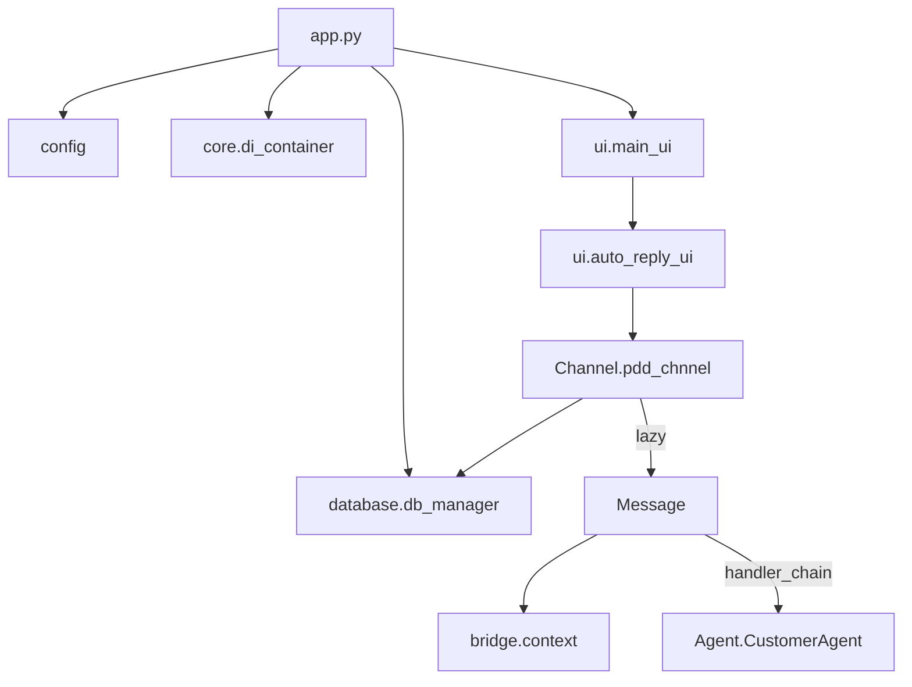

# 包导入与模块入口（`__init__.py`）

**功能**：说明各 Python 包**对外导出什么**、**启动时谁先 import 谁**、为何很多地方要写 **延迟 import**（`def` 里再 `from ... import`）。

项目中与「包导入」相关的主要文件：

| 文件 | 作用 |
|------|------|
| [app.py](../../app.py) | 进程级 import 顺序（最重要） |
| [bridge/__init__.py](../../bridge/__init__.py) | 统一导出 Context / Reply |
| [core/__init__.py](../../core/__init__.py) | DI、缓存、连接状态 |
| [database/__init__.py](../../database/__init__.py) | `db_manager` 代理 |
| [Message/__init__.py](../../Message/__init__.py) | 队列、消费者、Handler、handler_chain |
| [Message/handlers/__init__.py](../../Message/handlers/__init__.py) | 仅导出 Base/AI/Preprocessor |
| [Message/handler_chain_factory.py](../../Message/handler_chain_factory.py) | **故意不在** handlers/__init__，防循环依赖 |
| [Channel/pinduoduo/utils/__init__.py](../../Channel/pinduoduo/utils/__init__.py) | 拼多多 HTTP API 类 |
| [Message/core/__init__.py](../../Message/core/__init__.py) | 多为空或 re-export（以源文件为准） |

---

## 1. `app.py` 模块级 import（启动时立即执行）

| 行号 | import | 含义 |
|------|--------|------|
| 35 | `from config import config` | **必须第一**；全局配置单例。 |
| 38 | `from database import db_manager` | 触发 `database/__init__.py` → DI 代理，尚未一定连库。 |
| 41 | `from utils.logger_loguru import get_logger` | 日志。 |
| 44–45 | `configure_standard_services(_app_config)` | 注册 DI 服务（执行 import 副作用）。 |
| 49–50 | UI 样式、图标路径 | 不拉主窗口。 |

**在 `main()` 里才 import 的（延迟）**：

| import | 行号约 | 原因 |
|--------|--------|------|
| `MainWindow` | 123 | 避免启动前加载全部 UI + LanceDB。 |
| `init_main_thread_bridge` | 127 | 需要已有 `QApplication`。 |
| `get_human_assist_bus` | 130 | 需要 Qt。 |
| `secure_config` | 141 | 可选 .env。 |

详见 [01-启动入口-app.py](./01-启动入口-app.py.md)。

---

## 2. `bridge/__init__.py`（全文逐行）

| 行号 | 代码 | 含义 |
|------|------|------|
| 8 | `from bridge.context import Context, ContextType, ChannelType, PinduoduoKwargs` | 包内用绝对路径 `bridge.context`（与相对导入等价，取决于 sys.path）。 |
| 9 | `from bridge.reply import Reply` | AI 返回封装。 |
| 11 | `__all__ = [...]` | `from bridge import Context` 时只导出这些名字。 |

**常用写法**：

```python
from bridge.context import Context, ContextType
from bridge.reply import Reply, ReplyType
```

---

## 3. `database/__init__.py`（全文逐行）

| 行号 | 代码 | 含义 |
|------|------|------|
| 8 | `from .db_manager import DatabaseManager, get_db_manager` | 真实实现类。 |
| 9 | `from core.service_providers import _create_proxy` | 懒代理工厂。 |
| 12 | `db_manager = _create_proxy(DatabaseManager)` | **全局 `db_manager`** 第一次访问时才从 DI 容器取实例。 |
| 14 | `__all__ = [...]` | 对外 API。 |

**效果**：全项目 `from database import db_manager` 不用改，但实际实例由 [core/di_container.py](../../core/di_container.py) 管理。

---

## 4. `core/__init__.py`（全文逐行）

| 行号 | 导出 | 含义 |
|------|------|------|
| 6 | `DIContainer`, `container`, `configure_standard_services` | 依赖注入。 |
| 7 | `MemoryCache` | 内存缓存。 |
| 8 | `BaseService` | 服务基类。 |
| 9 | `ConnectionStatusManager`, `ConnectionState`, `ConnectionStatus` | 多账号 WS 状态。 |

**未在 `__init__` 导出、需直接路径 import 的**：

- `core.human_assist_bus`
- `core.human_assist_ui`
- `core.session_idle_closer`
- `core.ops_telemetry`

避免 `import core` 时拉起过多子模块。

---

## 5. `Message/__init__.py`（关键行）

| 行号 | 代码 | 含义 |
|------|------|------|
| 7–9 | `from .core.queue import ...` `from .core.consumer import ...` | 队列与消费者单例 `queue_manager`, `message_consumer_manager`。 |
| 9 | `from .core.handlers import MessageHandler, ...` | 处理器抽象基类。 |
| 12–13 | `MessageWrapper`, `QueueStats` | 队列元素模型。 |
| 16–18 | `BaseHandler`, `AIReplyHandler`, `MessagePreprocessor` | 常用 Handler（**不含** Keyword、OrderLogistics 等，那些只在 factory 里懒加载）。 |
| 24 | `from bridge.context import Context, ...` | Message 包依赖 bridge。 |
| 31–79 | `put_message`, `start_consumer` 等 | 兼容旧 API 的函数封装。 |
| 114 | `from .handler_chain_factory import handler_chain` | 处理器链工厂**放在包末尾 import**，减轻与 handlers 子包的循环依赖。 |

**注意**：`from Message import put_message` 会执行整个 `Message/__init__.py`，包括 pull `AIReplyHandler` → 可能间接 import Agno/LanceDB。因此 `pdd_chnnel` 在函数内才 `from Message import put_message`。

---

## 6. `Message/handlers/__init__.py`

| 行号 | 导出 | 含义 |
|------|------|------|
| 6–8 | `BaseHandler`, `AIReplyHandler`, `MessagePreprocessor` | 子集导出。 |

**未导出**（在 [handler_chain_factory.py](../../Message/handler_chain_factory.py) 内按需 import）：

- `KeywordDetectionHandler`
- `OrderLogisticsHandler`
- `AfterSalesApplyHandler`
- `ImageVideoHumanHandler`

---

## 7. `Channel/pinduoduo/utils/__init__.py`

| 行号 | 导出 | 含义 |
|------|------|------|
| 6–11 | `BaseRequest`, `GetToken`, `SendMessage`, `GetUserInfo`, `GetShopInfo`, `AccountMonitor` | 监控/发消息/登录常用入口。 |

**未在 `__init__` 列出、但代码里直接 import 的**：

- `API.chat_orders.ChatOrdersAPI`
- `API.logistics`
- `API.open_platform_client`
- `API.send_message.send_ask_refund_apply`（方法在 `SendMessage` 类上）

```python
from Channel.pinduoduo.utils.API.send_message import SendMessage  # 最常见
from Channel.pinduoduo.utils import SendMessage  # 也可，经 __init__ 再导出
```

---

## 8. 典型延迟 import（防循环依赖）

| 位置 | 写法 | 原因 |
|------|------|------|
| `pdd_chnnel._process_websocket_message` | `from Message import put_message` | Channel ↔ Message 互相引用。 |
| `pdd_chnnel._setup_message_consumer` | `from Message import message_consumer_manager, handler_chain` | 同上 + 避免启动 UI 时加载。 |
| `handler_chain_factory._get_keyword_handler` | 函数内 `from .handlers.keyword_handler import ...` | Keyword 可能 import SendMessage → Channel。 |
| `human_assist_bus.build_escalation_payload` | 函数内 `from database.db_manager import db_manager` | bus 被 Message 路径早期引用。 |
| `ai_handler` / `ai_reply_watchdog` | 函数内 `from core.human_assist_bus import emit_human_assist` | UI + asyncio 线程。 |

**原则**：模块级只 import「轻量、无环」的依赖；**Channel / Message / UI / Agent** 交叉处用函数内 import。

---

## 9. 推荐 import 写法（新代码）

| 场景 | 推荐 |
|------|------|
| 消息类型 | `from bridge.context import Context, ContextType` |
| 配置 | `from config import config` 或 `config.get("chat.xxx")` |
| 数据库 | `from database import db_manager` |
| 发拼多多消息 | `from Channel.pinduoduo.utils.API.send_message import SendMessage` |
| 入队 | `from Message import put_message`（仅在 asyncio 渠道线程） |
| DI 服务 | `from core.di_container import container` |
| 处理器链 | `from Message.handler_chain_factory import handler_chain` 或 `from Message import handler_chain` |

---

## 10. 与桌面/文档目录的对应

若你只复制了 `代码逐行解读/01–15`，**本篇为第 16 篇**，专门补「包导入」；请一并放入 `代码逐行解读/` 目录阅读。

---

## 11. 导入依赖简图


