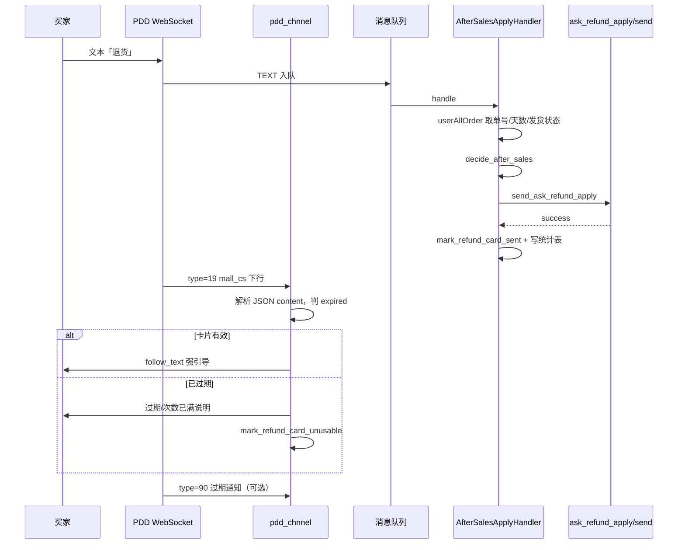

# 售后代申请（快捷退款卡）开发说明

> 面向在本仓库内维护 **商家代消费者申请售后 / 快捷退款卡** 功能的开发者。  
> 前置阅读：[代码架构说明.md](./代码架构说明.md)、[拼多多退换货卡片-可行性调研.md](./拼多多退换货卡片-可行性调研.md)

---

## 1. 功能概述

买家在聊天中说「退货 / 退款 / 换货」等话术时，系统在满足策略的前提下调用拼多多 MMS 非公开接口 `ask_refund_apply/send`，向买家推送 **type=19** 模板卡片（`template_name=ask_refund_apply`，界面常称「快捷退款」）。

**与以下能力区分：**

| 能力 | 说明 |
|------|------|
| **代申请卡（本文）** | `SendMessage.send_ask_refund_apply` → 买家点卡确认 → 弹出页填理由提交 |
| **买家订单卡（入站）** | 买家发 `sub_type=1` 订单信息 → `ORDER_INFO`，不主动发同类卡 |
| **文字引导自助售后** | 不发卡，话术引导订单详情「申请售后」 |
| **开放平台售后 API** | `after_sales.py`，处理已提交售后单，不发聊天卡 |

关闭自动发卡：配置 `chat.after_sales_apply_enabled: false`，仅走 AI / 关键词 / 人工。

---

## 2. 业务策略（当前默认）

策略实现：`utils/after_sales_policy.py`  
订单天数：`Channel/pinduoduo/utils/API/chat_orders.py` 的 `days_since_purchase`（基于 `payTime`，作「收货后时效」近似）。

| 发货状态 | 下单距今 | 买家意图 | 动作 |
|----------|----------|----------|------|
| **未发货** (`shippingStatus=0`) | — | 退货/退款/一般 | 发 **未发货退款卡** `after_sales_type=1` |
| 未发货 | — | **明确换货** | **转人工** |
| **已发货** | **≤7 天（含第 7 天）** | 一般 / 退货退款 | **退货退款卡** `type=3` |
| 已发货 | ≤7 天 | **明确换货** | **换货卡** `type=4` |
| 已发货 | **7＜天≤90** | 一般 / 换货 | **换货卡** `type=4` |
| 已发货 | 7＜天≤90 | 退货退款 / 仅退款 | **转人工** |
| 任意 | **＞90 天** | — | **转人工** |
| 已发货 | — | **仅退款** | **转人工**（不发 `type=2` 卡） |

配置项：

- `chat.after_sales_apply_return_refund_days`：默认 **7**
- `chat.after_sales_apply_exchange_max_days`：默认 **90**
- 若配置 `after_sales_apply_return_refund_hours`，会覆盖天数（小时 ÷ 24）

处理器入口：`Message/handlers/after_sales_apply_handler.py`（处理器链第 3 位，见 `Message/handler_chain_factory.py`）。

---

## 3. 端到端数据流



**要点：**

1. `send` 返回 **success ≠ 卡片可用**，以 type=19 里 `mstate.status` / `expire_text` 为准。  
2. **跟发文案**在确认未过期后再发，避免「教操作但卡已死」。  
3. `Context.content` 入队前会被 `json.dumps`，即时处理路径须用 `_context_struct_payload()` 反序列化（`pdd_chnnel.py`）。

---

## 4. 核心模块索引

| 模块 | 路径 | 职责 |
|------|------|------|
| 策略 | `utils/after_sales_policy.py` | 意图识别、`decide_after_sales` |
| 处理器 | `Message/handlers/after_sales_apply_handler.py` | 拉单、策略、发卡、冷却、失败话术 |
| 订单/参数 | `Channel/pinduoduo/utils/API/chat_orders.py` | 金额（分）、`build_ask_refund_apply_params`、`refund_card_push_expired` |
| 发送 | `Channel/pinduoduo/utils/API/send_message.py` | `send_ask_refund_apply`、可选 `valid_time` |
| 下行解析 | `Channel/pinduoduo/pdd_message.py` | type=19 → `ask_refund_card_push`；type=90 → `refund_card_expired` |
| 即时处理 | `Channel/pinduoduo/pdd_chnnel.py` | `_handle_mall_cs_message`、`_handle_mall_system_msg` |
| 会话缓存 | `utils/session_order_cache.py` | 最近订单、同单只发一次、过期标记 |
| 次数统计 | `utils/merchant_refund_apply_record.py` + `database/models.py` `MerchantRefundApplyLog` | 本单/今日买家/今日全店 |
| 实时聊天 | `ui/chat_ui.py` | 人工/AI 切换（已移除占位「资料」按钮） |

---

## 5. 拼多多协议备忘

### 5.1 聊天消息 `message.type`（与售后 API 无关）

| type | 含义 |
|------|------|
| 0 | 文本/订单子类型等 |
| 1 | 图片 |
| **19** | **模板卡**（代申请售后） |
| 90 | 系统通知（卡过期 `status=4` 等） |

### 5.2 `ask_refund_apply/send` 常用字段

| 字段 | 说明 |
|------|------|
| `order_sn` | 订单号 |
| `after_sales_type` | 1 未发货退款；3 退货退款；4 换货 |
| `question_type` | 未发货建议 **0**；已发货默认 1 |
| `refund_amount` | **分**（`userAllOrder` 金额已是分，勿 ×100） |
| `user_ship_status` | 0 未发货 / 1 已发货 |
| `valid_time` | 可选 Unix 秒；平台可能仍按约 24h 展示，且**不能**挽救 `mstate` 已过期 |

### 5.3 卡片是否有效（下行）

有效（可发跟文）：`mstate.status=0` 且 `expire_text` 为空。  
无效（一出生就过期）：`mstate.status=1` 且 `expire_text=已过期`（常与**同单重复代申请 / 店铺或买家额度用尽**有关，与请求里 `valid_time` 无直接关系）。

实现：`refund_card_push_expired()` in `chat_orders.py`。

---

## 6. 配置项（`config.json` → `chat.*`）

| 键 | 默认 | 说明 |
|----|------|------|
| `after_sales_apply_enabled` | `true` | 总开关 |
| `after_sales_apply_return_refund_days` | `7` | 已发货退货退款窗口（天，含边界） |
| `after_sales_apply_exchange_max_days` | `90` | 换货窗口上限 |
| `after_sales_apply_card_valid_hours` | `48` | 请求 `valid_time` 用（可选） |
| `after_sales_apply_send_card_valid_time` | `true` | 是否在 send 中带 `valid_time` |
| `after_sales_apply_question_type_unshipped` | `0` | 未发货原因码 |
| `after_sales_apply_follow_text` | 见 `config.py` | 卡有效后的强引导 |
| `after_sales_apply_*_notice` | 多条 | 失败/过期/额度/转人工等话术 |
| `after_sales_apply_cooldown_sec` | `300` | 同买家触发冷却 |
| `after_sales_apply_fail_cooldown_sec` | `300` | 发卡失败冷却 |
| `after_sales_apply_quota_cooldown_sec` | `86400` | 平台「次数已满」类错误冷却 |

示例见 `config.json.example`。

---

## 7. 防重复与订单级状态（SQLite）

表 **`merchant_refund_apply_logs`** 字段 `status`：`pending` | `expired` | `failed`，以及 `valid_time_unix`（平台 type=19 的 `mstate.valid_time`）。

| 时机 | 行为 |
|------|------|
| **发卡前** `check_refund_apply_gate(order_sn)` | `pending` 且 `now < valid_time` → 回复「已提交，请耐心等待」；`expired`/`failed`（或 pending 已过 valid_time）→ 回复超时引导自助/人工 |
| **send 成功** | 写入 `pending`（`valid_time` 待 type=19 补全） |
| **send 失败** | 写入 `failed`，走原有降级话术，不再发卡 |
| **type=19 下行** | 更新 `card_msg_id`、`valid_time_unix`；若已过期则 `status=expired` |
| **type=90** | `mark_refund_apply_expired` |

另有 `session_order_cache.mark_refund_card_unusable` 作内存标记；买家冷却 `_COOLDOWN` 防连发 MMS。

配置话术：`after_sales_apply_pending_notice`、`after_sales_apply_record_expired_notice`。

---

## 8. 代申请次数统计

- 表：`merchant_refund_apply_logs`（`database/models.py`）
- 写入：发卡成功/失败时 `record_apply_attempt`
- 更新：type=19 下行时 `update_apply_card_outcome(card_expired=...)`
- 日志示例：`代申请退款统计 order_sn=... 本单成功=1 今日该买家=2 今日全店=5`

查询：

```sql
SELECT id, shop_id, buyer_uid, order_sn, api_success, card_expired, created_at
FROM merchant_refund_apply_logs
ORDER BY id DESC LIMIT 50;
```

---

## 9. 实时聊天（`ui/chat_ui.py`）

| 按钮 | 作用 |
|------|------|
| **转 AI** | `ai_mode=true`，新消息走 AI |
| **人工接待** | `ai_mode=false`，AI 不自动回 |
| **结束会话** | 结案当前会话 |

顶部 **「资料」按钮已移除**（原占位未实现）。

---

## 10. 排错指南

| 现象 | 常见原因 | 处理 |
|------|----------|------|
| 接口 success 但卡「已过期」 | 同单/同买家代申请额度用尽 | 换**新订单**或新买家测；勿重复 send |
| 日志无「快捷退款卡下行」 | 旧版未解析 JSON content | 确认含 `_context_struct_payload` 的 `pdd_chnnel` |
| `question_type=0` 仍显示「其他原因」 | 平台展示 | 以买家第二步能否提交为准 |
| 策略像 2 天不是 7 天 | `return_refund_hours: 48` 覆盖 | 删 hours 或改为 168 |
| 跟文发了但卡过期 | 旧逻辑先发跟文 | 应仅在 `expired=false` 后发 |

验收日志关键字：

- `售后策略 ... ship=0 type=1`（未发货）
- `快捷退款卡下行 ... expired=false`
- `代申请退款统计 ...`

---

## 11. 测试

```bash
uv run python -m pytest test/test_after_sales_policy.py \
  test/test_chat_orders_refund_amount.py \
  test/test_after_sales_apply_handler.py \
  test/test_ask_refund_card_messages.py \
  test/test_mall_system_refund_expired.py \
  test/test_pdd_context_struct_payload.py \
  test/test_merchant_refund_apply_record.py -q
```

本地联调（需真实 Cookie）：

```bash
uv run python scripts/test_after_sales_card_live.py --uid <买家uid> --text 退货
```

---

## 12. 扩展开发提示

1. **按确认收货时间策略**：需在 `chat_orders` 增加收货时间字段解析，再传入 `decide_after_sales`。  
2. **仅引导不发卡**：`after_sales_apply_enabled: false` 或新增 `mode: guide_only`。  
3. **type=90 重复通知**：可在 `_notify_refund_card_unusable` 加短时间去重。  
4. **sendUserHelpLink**：调研文档提及，仓库未实现，需单独抓包。

---

## 13. 相关文档

- [10-发送消息-send_message.py.md](./代码逐行解读/10-发送消息-send_message.py.md)
- [15-拼多多原始消息-pdd_message.py.md](./代码逐行解读/15-拼多多原始消息-pdd_message.py.md)
- [13-实时聊天-ai_mode-chat_ui.md](./代码逐行解读/13-实时聊天-ai_mode-chat_ui.md)
- [小白使用说明.md](./小白使用说明.md)（面向运营/店主）
