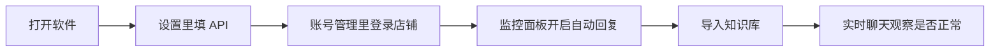

# 拼多多 AI 客服助手 — 小白使用说明

> 本文面向**第一次使用**的商家/运营，尽量用通俗语言说明「这是什么、怎么装、怎么开、怎么用」。  
> 技术细节与开发说明请看项目根目录的 [README.md](../README.md)。

---

## 一、这个软件是干什么的？

这是一台电脑上的**桌面程序**（不是网页），主要帮你做这些事：

| 能力 | 通俗解释 |
|------|----------|
| **接拼多多买家消息** | 登录店铺后，通过官方通道接收买家在聊天里发的文字、图片等 |
| **AI 自动回复** | 根据你配置的大模型（如通义、DeepSeek）和**知识库**，自动回答常见问题 |
| **转人工** | 买家说「转人工」等关键词，或 AI 超时/失败时，**弹窗提醒你**去实时聊天里接手 |
| **实时聊天** | 像商家后台一样看会话列表、自己打字回复买家 |
| **知识库** | 上传商品说明、FAQ 等文档，让 AI 回答更贴近你的店铺 |
| **关键词** | 自定义哪些词一出现就转人工、走平台转接等 |
| **物流/退换货（可选）** | 配置了拼多多开放平台或相关功能后，可查物流、发退换货卡片等 |

你可以把它理解成：**AI 先顶前面，搞不定再叫你上**。

---

## 二、使用前需要准备什么？

### 1. 电脑环境（macOS 为例）

- 系统：macOS / Windows / Linux 均可（你当前多为 Mac）
- **Python 3.11 或更高**（一般通过安装脚本会自动用项目里的虚拟环境，你不用自己懂 Python）
- 能正常上网（连拼多多、连 AI 接口）

### 2. 账号与密钥

| 准备项 | 是否必须 | 说明 |
|--------|----------|------|
| 拼多多商家账号 | **必须** | 用于登录店铺、收消息 |
| 大模型 API Key | **必须** | 在「设置」里填，或写在 `config.json` 的 `llm` / `embedder` |
| 拼多多开放平台 | 可选 | 查物流轨迹等需要在 `config.json` 里配置 `pinduoduo_open` |
| 商品/FAQ 文档 | 建议 | 导入「知识库」后 AI 更准 |

### 3. 项目文件夹在哪？

本说明默认项目在：

```text
~/Downloads/Customer-Agent-main
```

下面有 `app.py`、`.venv` 文件夹、`config.json` 等。  
**不要删 `.venv`**，那是程序依赖环境。

---

## 三、怎么启动程序？（三种方式）

### 方式 A：桌面「启动 AI 客服.command」（推荐）

1. 在桌面找到 **`启动 AI 客服.command`**
2. **双击**（第一次若提示无法打开，可在「系统设置 → 隐私与安全性」里允许）
3. 会弹出一个**终端窗口**，显示「正在启动…」
4. 几秒后出现 **「拼多多 AI 客服助手」** 主窗口

脚本会自动去找项目目录（例如 `~/Downloads/Customer-Agent-main`），并启用 `.venv` 里的 Python。  
若项目不在默认位置，可把该 `.command` 文件**复制到项目根目录**（和 `app.py` 同级），或设置环境变量：

```bash
export AGENT_CUSTOMER_HOME="/你的/项目/完整路径"
```

### 方式 B：项目里的「启动 AI 客服.app」

项目内可能有 **`启动 AI 客服.app`**（macOS 应用包）。  
注意：应用包需要能正确找到旁边的 `app.py` 和 `.venv`；若双击没反应，请优先用**方式 A** 或**方式 C**。

### 方式 C：终端手动启动（适合会一点命令行的用户）

```bash
cd ~/Downloads/Customer-Agent-main
source .venv/bin/activate
python app.py
```

首次没有 `.venv` 时，可先执行：

```bash
cd ~/Downloads/Customer-Agent-main
pip install uv    # 若未安装 uv
uv sync
uv run playwright install chromium   # 用于拼多多网页登录
```

---

## 四、第一次打开后要做的事（建议顺序）



### 步骤 1：配置 AI（「设置」页）

- 打开左侧底部 **「设置」**
- 填写 **模型名称、API 地址、API Key**（与 `config.json` 里 `llm`、`embedder` 一致）
- 保存后，可用底部 **「AI 测试」** 发一句试试能否回复

> **提示**：`config.json` 在首次运行后生成，里面有密钥，**不要发到网上或提交到 Git**。

### 步骤 2：登录拼多多店铺（「账号管理」）

- 进入 **「账号管理」**，添加/选择店铺
- 按界面提示用浏览器完成登录（程序会用 Playwright 保存 Cookie）
- 登录成功后，监控里应能看到该账号**在线**

### 步骤 3：开启自动回复（「监控面板」）

- 在 **「监控面板」** 对对应账号点击**启动/连接**
- 连接成功后，买家消息会进入队列，由 AI 和规则自动处理

### 步骤 4：维护知识库与关键词（可选但强烈建议）

- **「知识库」**：上传 PDF、Excel、TXT 等，让 AI 检索你的商品话术
- **「关键词」**：例如「转人工」「投诉」等，命中后转人工或走平台转接

### 步骤 5：用「实时聊天」盯会话

- **「实时聊天」** 左侧选店铺 → 选买家会话
- 右侧看记录，必要时自己打字回复（见下文「人工 / AI 模式」）

---

## 五、主界面各菜单是做什么的？

| 菜单 | 干什么用 |
|------|----------|
| **监控面板** | 看哪些店铺账号已连接、启动/停止自动回复 |
| **实时聊天** | 人工查看和回复买家；切换 AI / 人工接待 |
| **后台看板** | 运营数据汇总（会话、转人工等，视版本功能而定） |
| **知识库** | 增删改查知识文档，供 AI 检索 |
| **关键词** | 配置触发转人工或特殊处理的词 |
| **账号管理** | 拼多多店铺账号、登录状态 |
| **日志** | 查看运行日志，排查报错 |
| **设置** | 模型、路径、部分业务参数 |
| **AI 测试** | 不连店铺，单独测模型回复效果 |

---

## 六、核心概念（必读）

### 1. AI 接待 vs 人工接待

在 **实时聊天** 顶部可以切换：

| 模式 | 含义 |
|------|------|
| **AI 自动接待** | 买家新消息会交给 AI（及自动规则）处理 |
| **人工接待中** | AI **不会**自动回买家，需要你本人在输入框回复 |

**10 秒规则（人工 → AI）**  
当你切成「人工接待」后，若在输入框 **10 秒内没有任何操作**（没打字、没点输入框等），系统会**自动切回 AI 接待**，并提示「输入框 10 秒无活动…」。  
这样避免你忘了切回 AI，导致买家一直没人自动回。

**离开聊天页**  
若当前会话是人工模式，你切换到别的页面/会话时，也可能自动切回 AI（便于后续消息继续自动处理）。

### 2. 150 秒未回复兜底（转人工弹窗）

这是**安全网**，防止买家一直没人理：

1. 买家发来一条需要处理的消息后，系统开始计时（默认 **150 秒**，可在配置里改）
2. 若这段时间内**没有任何成功发给买家的回复**（AI、自动话术、你在实时聊天里发的都算）
3. 则：
   - 弹出 **「买家申请转人工」** 类提示窗，可点「去处理」跳进会话
   - 给买家发一句默认话术：**「不好意思亲亲，让你久等了」**（可配置）

相关配置在 `config.json` 的 `chat` 段：

```json
"ai_watchdog_enabled": true,
"ai_watchdog_escalate_sec": 150,
"ai_watchdog_escalate_notice": "不好意思亲亲，让你久等了"
```

测试时可临时把 `ai_watchdog_escalate_sec` 改成 `60`，方便观察。

### 3. 消息是怎么被处理的？（简化流程）

买家消息进入后，大致按顺序尝试（**谁先处理成功谁结束**）：

```text
改地址/物流类 → 图片视频转人工 → 退换货意向发卡 → 关键词转人工 → AI 回复 → 其它兜底
```

所以你看到的现象可能是：

- 买家说「退货」→ 可能直接发退换货卡片，**不会**再走 AI 长文回复  
- 买家说「转人工」→ 关键词命中，弹窗 + 平台转接逻辑  
- 普通咨询 → AI 回复；AI 太慢或失败 → 150 秒兜底或立即转人工  

### 4. 买家离线自动「结案」

默认约 **5 分钟**无新消息后，会话可能标记为已结束（`closed`），后台看板里会体现「是否解决」。  
买家再次说话通常会重新打开会话。  
可在 `config.json` 调整 `session_idle_resolve_minutes` 等。

---

## 七、配置文件 `config.json` 简明对照

文件位置：一般在项目根目录，或用户数据目录（打包版可能在「文档」下）。  
**不要**把含真实 Key 的文件分享给别人。

| 配置块 | 小白只需知道 |
|--------|----------------|
| `llm` | 对话模型：Key、地址、模型名 |
| `embedder` | 知识库向量化用的嵌入模型 |
| `knowledge_base` | 知识库文件与向量库路径 |
| `prompt` | AI 角色设定（如「美甲灯客服」） |
| `chat.ai_watchdog_*` | 150 秒兜底开关、秒数、安抚话术 |
| `chat.manual_mode_send_notice` | 人工模式下是否自动给买家发一句「稍等」 |
| `chat.after_sales_apply_*` | 退换货卡片相关话术与开关 |
| `pinduoduo_open` | 开放平台：查物流等 |

完整示例见项目里的 **`config.json.example`**，可复制后改名为 `config.json` 再改值。

---

## 八、日志在哪里？出问题了怎么看？

| 位置 | 内容 |
|------|------|
| 软件内 **「日志」** 页 | 界面里直接看最近记录 |
| 项目下 `logs/app.log` | 运行日志 |
| macOS `~/Library/Logs/AgentCustomer/boot.log` | 启动、崩溃类信息 |

排查 **150 秒兜底** 时，可在日志里搜：

- `watchdog 已启动` — 计时已开始  
- `买家进线后 ... 内无成功出站回复，转人工` — 已触发兜底  
- `emit_human_assist 跳过` — 弹窗没出来，多半是账号/买家信息没解析到  

---

## 九、常见问题（FAQ）

### Q1：双击 `.command` 闪一下就没窗口了？

- 看终端里红色报错：是否找不到项目路径、没有 Python、没有 `.venv`  
- 在项目目录执行一次：`uv sync`  
- 确认 `~/Downloads/Customer-Agent-main/app.py` 存在  

### Q2：AI 从不回复买家？

- 监控面板里账号是否**已连接**  
- 设置里 API Key 是否正确；用 **AI 测试** 验证  
- 实时聊天里该会话是否是 **AI 自动接待**（不是人工接待）  
- 看日志是否有 LLM 报错、Cookie 过期（需重新登录）  

### Q3：一直没有 150 秒弹窗？

- 确认 `chat.ai_watchdog_enabled` 为 `true`  
- 是否其实已经有回复发出（AI、关键词话术、你手动发过都会取消计时）  
- 是否仍在 **人工接待** 且你自己没回——计时从买家消息开始，150 秒内任意成功回复都会取消  
- **完全退出并重启** 程序后再测  

### Q4：人工模式怎么又变回 AI 了？

- **10 秒无输入**会自动切回 AI（设计如此）  
- 离开当前会话/页面也可能切回 AI  

### Q5：Playwright / 登录失败？

在项目目录执行：

```bash
source .venv/bin/activate
playwright install chromium
```

然后在账号管理里重新登录。

### Q6：`config.json` 和 `.env` 有什么区别？

- 主配置多在 **`config.json`**（界面「设置」会写入）  
- **`.env`** 可选，用于把密钥放在环境变量（见 `.env.example`）  
- 二者都不要提交到公开仓库  

---

## 十、文件/启动方式对照表

| 文件 | 作用 |
|------|------|
| `app.py` | 程序主入口 |
| `.venv/` | Python 依赖环境（自动生成） |
| `config.json` | 运行配置（含密钥，勿泄露） |
| `config.json.example` | 配置模板（无真实密钥） |
| `启动 AI 客服.command`（桌面） | 双击启动，自动找项目目录 |
| `启动 AI 客服.app` | macOS 应用图标启动（需路径正确） |
| `docs/拼多多退换货卡片-可行性调研.md` | 退换货功能技术调研（偏开发） |
| `docs/小白使用说明.md` | **本文档** |

---

## 十一、建议的日常使用习惯

1. 每天开店前：看 **监控面板** 是否在线，必要时重新登录。  
2. 上新/改价后：更新 **知识库**。  
3. 活动期：检查 **关键词**（转人工、投诉类）。  
4. 听到弹窗或看到「转人工」：优先进 **实时聊天** 处理。  
5. 出怪问题时：先 **日志**，再查 `config.json` 是否误改。  

---

## 十二、需要更多帮助时

- 开发/报错细节：[ERRORS.md](../ERRORS.md)、[API.md](../API.md)  
- 参与修改代码：[CONTRIBUTING.md](../CONTRIBUTING.md)  
- 问题反馈：GitHub Issues（见 README 里的链接）  

---

*文档版本：与当前仓库功能同步（含消费者层 150 秒兜底、人工 10 秒切回 AI、桌面启动脚本自动定位项目）。若界面文案与本文不一致，以你安装的版本为准。*
